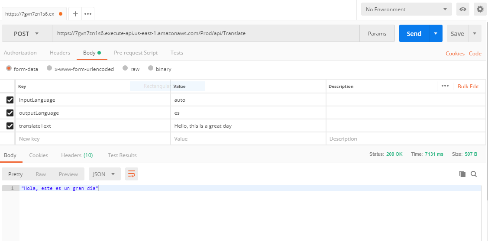

## Purpose
The solution creates an ASP.NET WebAPI based AWS Serverless application (Lambda) that helps translate text from one language to another using Amazon Translate Service

## Setup Instructions (for Visual Studio on Windows)
* Clone the repository to your local machine
* Build and make sure there are no build errors
* Right click on the project name and select _Publish to AWS Lambda..._ from the context menu
* You should be able to invoke the Lambda through the API Gateway using Postman or similar tools. Following screenshot shows how to compose a sample request using Postman



## Here are some steps to follow to get started from the command line:

Once you have edited your template and code you can use the following command lines to deploy your application from the command line (these examples assume the project name is *TranslateAPI*):

Restore dependencies
```
    cd "TranslateAPI"
    dotnet restore
```

Deploy application
```
    cd "TranslateAPI/src/TranslateAPI"
    dotnet lambda deploy-serverless
```