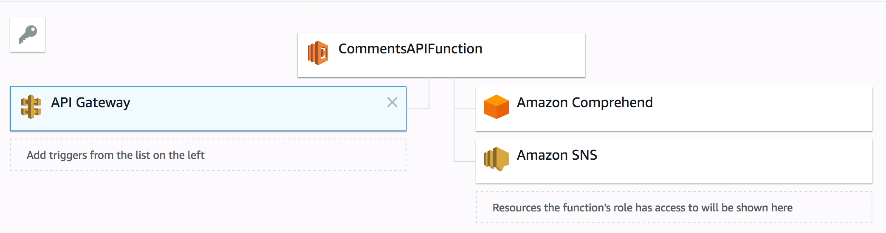

# What does this application do?
This project has a lambda function that takes a text string as input, identifies the sentiment of the text through Amazon Comprehend service. If the text is found to have a _NEGATIVE_ sentiment, it triggers a notification to a topic. All subscribers to that topic will receive the notification message.

# Setup Instructions (for Visual Studio on Windows)
* Clone the repository to your local machine
* Create an IAM Role and attach the following policies to it
    * ComprehendReadOnly
    * AmazonSNSFullAccess
* Open serverless.template file and update the _Role_ attribute with the ARN of the IAM Policy you created in the previous step
* Build and make sure there are no build errors
* Right click on the project name and select _Publish to AWS Lambda..._ from the context menu
* Make sure the value for _ShouldCreateSNSTopic_ is set to true when you run the template for the first time and publish
* Once completed successfully, you should be able to see a setup similar to this on the AWS Lambda console

* Navigate to SNS home page on the AWS Console, you should be able to see a new topic called _CommentNotifier_ there
* Create a new email subscription to the topic and set it up to receive emails
* You should be able to invoke the Lambda through the API Gateway using Postman or similar tools. If you send a negative text, the Lambda will sense it through AWS Comprehend and send you a notification through SNS


## Here are some steps to follow to get started from the command line:

Once you have edited your template and code you can use the following command lines to deploy your application from the command line (these examples assume the project name is *CommentsAPI*):

Restore dependencies
```
    cd "CommentsAPI"
    dotnet restore
```

Execute unit tests
```
    cd "CommentsAPI/test/CommentsAPI.Tests"
    dotnet test
```

Deploy application
```
    cd "CommentsAPI/src/CommentsAPI"
    dotnet lambda deploy-serverless
```
